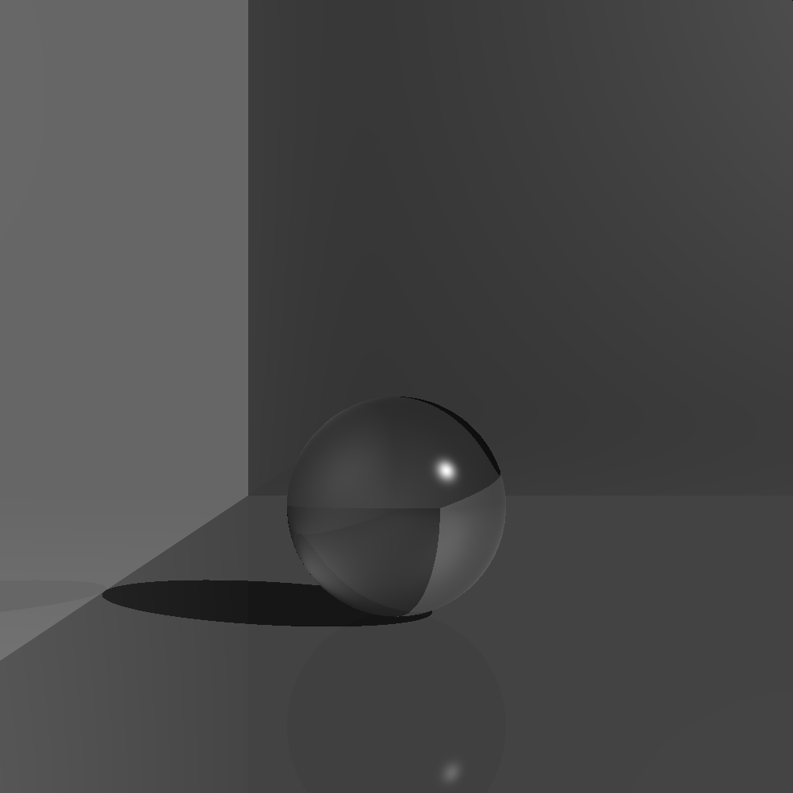
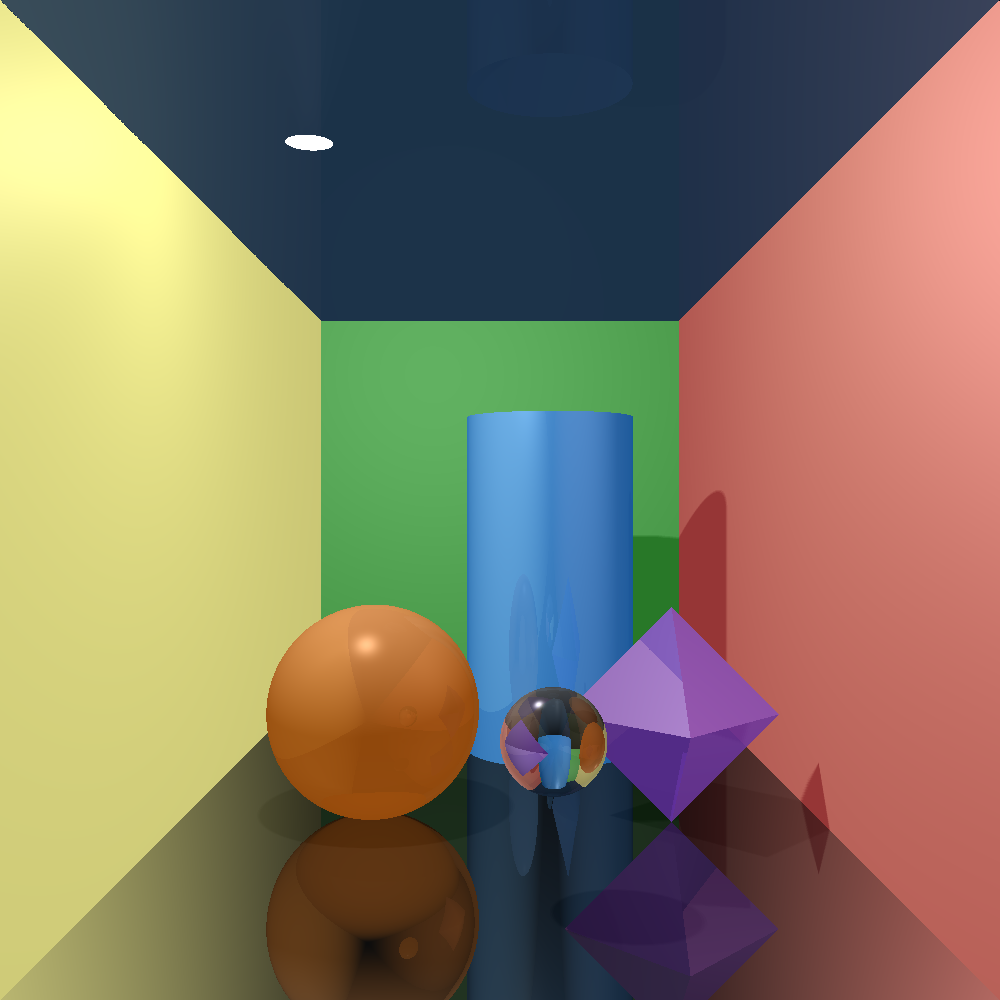
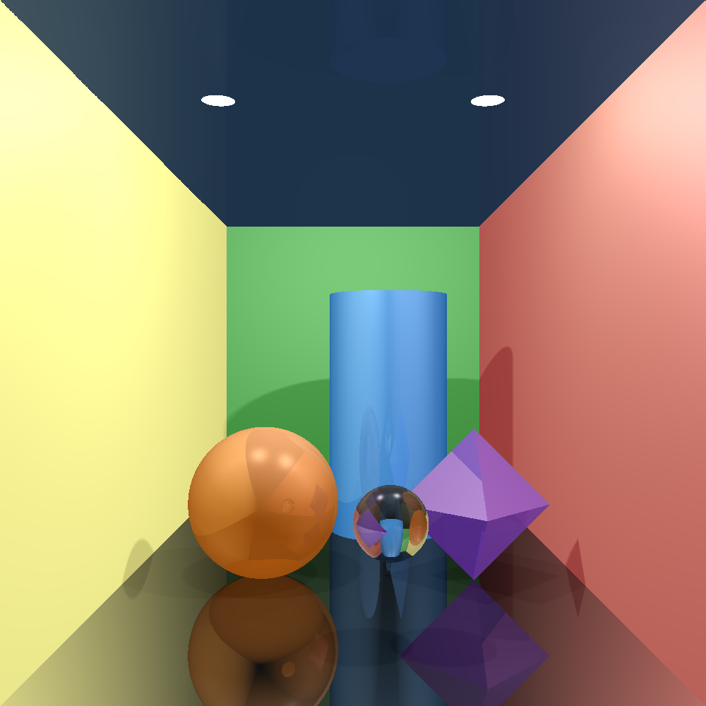

# Computer Graphics Project --- Ray Tracing

### Requirements

+ GNU GCC C++ compiler 5.4 (at least support C11)
+ CMake 3.5+
+ OpenCV (optional)
+ GLFW3 - OpenGL (optional)

To compile correctly, at least one of OpenCV and OpenGL is needed, and you can specify the option in the **CMakeLists.txt** file

### Instruction

1. Check **CMakeLists.txt**, and set build option, for example if you only have OpenGL library installed, you can set:    

   ```shell
   set(BUILD_WITH_OPENGL 1)
   set(BUILD_WITH_OPENCV 0) # which means you don't have OpenCV library
   ```

2. Then you can run these commands in the source directory to build

   ```shell
   mkdir build
   cmake ..
   make all -j8
   ```

3. After building, you will find 4 executable files

   ```shell
   tracer
   tracer_double
   tracer_single
   UnitTest
   ```

4. To visualize the result, you can run each executable like

   ```shell
   # command : [excutable name] [rendering method]
   # for example
   tracer_double opencv;
   UnitTest opengl;
   ```

   but remember, only **OpenCV** Rendering will save a **PNG** image snapshot under its root directory.

### Result

Each executable will generate a scene, and they are shown here

`UnitTest`

> This is a simple scene, which include 3 planes, 1 sphere and 1point light source. The rays are recursively traced **2** times. All objects' material use Phong reflection model. The differences are: 
>
> 1. The ***shininess*** term is different. It is obvious that the sphere is more shiny.
> 2. The planes and the sphere have different mirror property (reflection).
> 3. The sphere has glass property (transparency).
>
> 


`tracer`

> This scene contains 2 sphere, 1 cylinder, 1 octahedron and 5 planes, with 1 point light source. The rays are recursively traced **3** times.
>
> 1. only the front sphere is transparent.
> 2. All objects except the left, back and right planes have mirror property.
> 3. Due to different ***ambient*** light terms and reflect behaviors (***specular*** and ***diffuse*** term), the colors of the objects are different.
> 4. ***shininess*** terms are different
>
> But with one point light source, the shadow is *sharp*.
>
> 


`tracer_single`

> Compare to `tracer` , `tracer_single` has a different light source. In face, **9 point light sources** are used to simulate **1 circle light source**. and we can find that the shadow become *soft*.
>
> 


`tracer_double`

> I add another **circle light source** (In fact, there are total 12 point light source) in the scene. Maybe it's too bright?
>
> 


